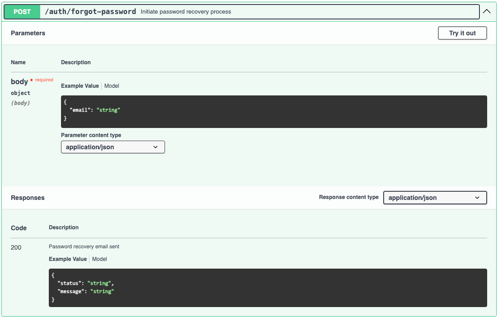

# Технические основы продуктового менеджмента. Проект - Визитки

## Описание
RESTful api проекта реализованы 2 двух вариациях

1. С помощью JSON формата - [api.json](api.json) для интерпретации данных прямо из файла и использования в коде backend
2. С помощью Swagger формата - [api.yaml](api.yaml) для наглядного отображения в IDE или https://editor.swagger.io/ пользователем и последующем использовании в тестировании запросов на backend со стороны клиента

## RESTful api

### Регистрация пользователя

### Аутентификация пользователя[api.json](api.json)

### Восстановление пароля

### Удаление аккаунта

### Обновление профиля пользователя

### Создание визитки

### Получение всех визиток пользователя

### Обновление визитки

### Удаление визитки
